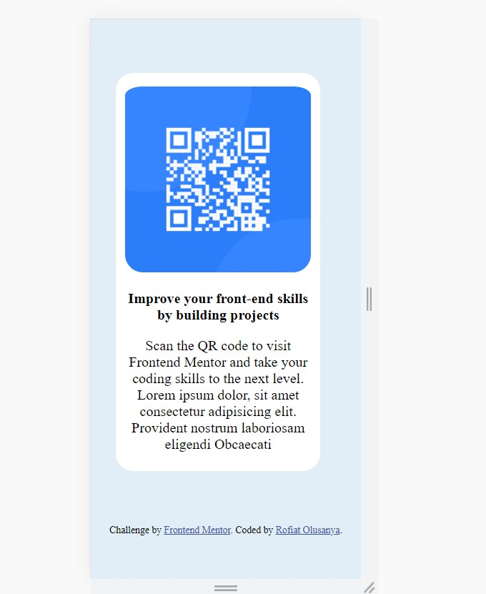

# Frontend Mentor - QR code component

## Welcome! 👋

Thanks for checking out this front-end coding challenge.

[Frontend Mentor](https://www.frontendmentor.io) challenges help you improve your coding skills by building realistic projects.

**To do this challenge, you need a basic understanding of HTML and CSS.**

## The challenge

The challenge was to build out this QR code component and get it as close as possible.

## Goal For building this challenge

The ain is to get better at front-end design and techniques.

